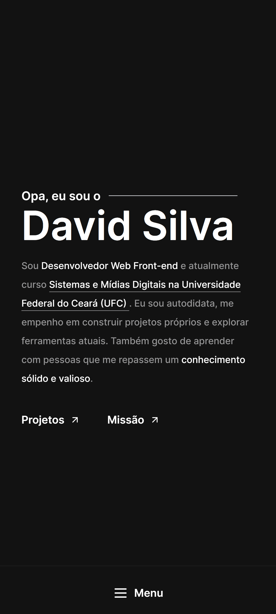

# Portfólio

## :sparkles: **Projeto**


Esse é meu portfólio, no qual apresento um pouco sobre mim, projetos e habilidades. Ele foi construído com um sistema de navegação no qual as setas o levam para uma das seções do site.

[Veja o projeto completo aqui.](https://davidsilvam.vercel.app)

## :art: **Visual do Projeto**

### _Desktop e Telas Maiores_

<div align="center">
    
</div>

### _Mobile e Telas Menores_

<div align="center">
    
</div>

## :wrench: **Tecnologias**

### :hammer: **Construção do site**

- [TypeScript](https://www.typescriptlang.org)
- [Nuxt 3](https://nuxt.com)
- [NuxtImage](https://v1.image.nuxtjs.org)
- [i18n](https://v8.i18n.nuxtjs.org)
- [Node e NPM](https://nodejs.org/)
- [Vite](https://vitejs.dev/)

### :art: **Estilização**

- [Tailwind CSS](https://tailwindcss.com)
- [Heroicons](https://heroicons.com)
- [Google Fonts](https://fonts.google.com)

### :open_file_folder: **IDE, Versionamento e Deploy**

- [Visual Studio Code](https://code.visualstudio.com)
- [Git](https://git-scm.com)
- [GitHub](https://github.com)
- [Vercel](https://vercel.com/)

## :rocket: **Configurações e Instalação**

Veja [documentação de configuração do Nuxt 3](https://nuxt.com/docs/getting-started/introduction).

### **Clonando o Projeto**

```sh
git clone https://github.com/davsilvam/portfolio-v3.git
```

### **Executando o Projeto**

```sh
npm install
```

### **Compilar e abrir o programa para desenvolvimento**

```sh
npm run dev
```

### **Compilar e reduzir para produção**

```sh
npm run build
```

## :balance_scale: **Licença**

Esse projeto está sob a [licença MIT](https://github.com/davsilvam/portfolio-v3/blob/main/LICENSE.md).

<p align="center">
  Feito com :white_heart: por <a href="https://www.linkedin.com/in/davsilvam/">David Silva</a>.
</p>

---
